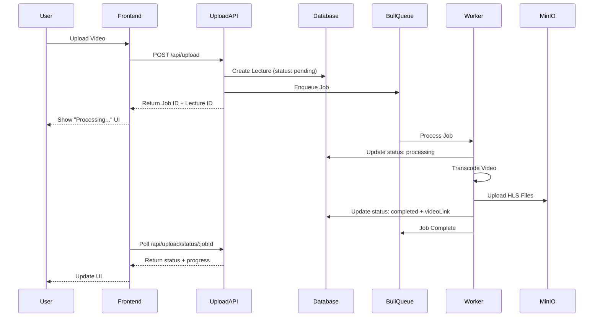

# Design Document: Asynchronous Video Processing

## Overview

This design transforms the Sarthi video processing system from a synchronous, blocking operation to an asynchronous, non-blocking architecture. The system will use Bull (Redis-backed job queue) to process videos in the background while providing immediate feedback to users. The design enables optimistic UI updates, status tracking, and resilient error handling.

## Architecture

### High-Level Flow

```
User Upload → Immediate Response → Background Processing → Status Updates
     ↓              ↓                      ↓                    ↓
  Video File    Job ID +            Bull Queue            Lecture Status
                Lecture ID          Processing            Updates in DB
```

### Component Interaction



## Components and Interfaces

### 1. Lecture Model Extension

**Current Schema:**
```javascript
{
  courseId: ObjectId,
  nameOfTopic: String,
  videoLink: String,
  noOfViews: Number,
  noOfLikes: Number,
  comments: Array
}
```

**Extended Schema:**
```javascript
{
  courseId: ObjectId,
  nameOfTopic: String,
  videoLink: String,
  processingStatus: {
    type: String,
    enum: ['pending', 'processing', 'completed', 'failed'],
    default: 'pending'
  },
  jobId: String,
  processingError: String,
  processingProgress: {
    stage: String,  // 'uploading', 'transcoding', 'uploading_to_storage'
    percentage: Number
  },
  noOfViews: Number,
  noOfLikes: Number,
  comments: Array
}
```

### 2. Upload API Endpoint

**Endpoint:** `POST /api/upload`

**Request:**
- Multipart form data with video file
- Field: `uploadedFile` (video file)

**Response (Immediate):**
```javascript
{
  success: true,
  lectureId: "507f1f77bcf86cd799439011",
  jobId: "1234567890_abc123",
  processingStatus: "pending",
  message: "Video upload initiated. Processing in background."
}
```

**Implementation Changes:**
- Remove `await job.finished()` blocking call
- Return immediately after enqueueing job
- Create lecture record before processing

### 3. Job Status API Endpoint

**Endpoint:** `GET /api/upload/status/:jobId`

**Response:**
```javascript
{
  jobId: "1234567890_abc123",
  status: "processing",
  progress: {
    stage: "transcoding",
    percentage: 45
  },
  lectureId: "507f1f77bcf86cd799439011",
  masterPlaylistUrl: null  // null until completed
}
```

**Status Values:**
- `pending`: Job queued but not started
- `processing`: Currently transcoding
- `completed`: Processing finished successfully
- `failed`: Processing encountered an error

### 4. Bull Queue Worker

**Queue Configuration:**
```javascript
const videoProcessingQueue = new Queue('video processing', {
  redis: process.env.REDIS_URL,
  defaultJobOptions: {
    attempts: 3,
    backoff: {
      type: 'exponential',
      delay: 2000
    },
    removeOnComplete: false,  // Keep for status checks
    removeOnFail: false
  }
});
```

**Worker Process:**
```javascript
videoProcessingQueue.process('process-video', 2, async (job) => {
  const { filePath, videoName, outputDir, resolutions, lectureId } = job.data;
  
  try {
    // Update lecture status to processing
    await updateLectureStatus(lectureId, 'processing', {
      stage: 'transcoding',
      percentage: 0
    });
    
    // Process video with progress updates
    const result = await processVideo(
      filePath, 
      videoName, 
      outputDir, 
      resolutions,
      (progress) => {
        job.progress(progress);
        updateLectureProgress(lectureId, progress);
      }
    );
    
    // Update lecture with completed status and video URL
    await updateLectureStatus(lectureId, 'completed', null, result.masterUrl);
    
    return result;
  } catch (error) {
    // Update lecture with failed status
    await updateLectureStatus(lectureId, 'failed', null, null, error.message);
    throw error;
  }
});
```

### 5. Lecture Routes Updates

**GET /api/lectures/:id**
- Include `processingStatus`, `jobId`, and `processingProgress` in response
- Frontend can use this to display status

**PATCH /api/lectures/:id/update**
- Allow `nameOfTopic` updates regardless of status
- Prevent `videoLink` updates when status is 'pending' or 'processing'

**DELETE /api/lectures/:id**
- If status is 'processing', cancel the Bull job
- Clean up temporary files
- Remove lecture record

### 6. Frontend Integration Points

**Upload Component:**
```javascript
// After upload
const response = await uploadVideo(file);
// Immediately close modal
setModalOpen(false);
// Show lecture in list with "Processing..." badge
addLectureToList({
  ...response,
  processingStatus: 'pending'
});
```

**Status Polling (Optional):**
```javascript
// Poll every 5 seconds if status is not completed
const pollStatus = async (jobId) => {
  const status = await fetch(`/api/upload/status/${jobId}`);
  if (status.processingStatus === 'completed') {
    // Update lecture in UI with video link
    updateLectureInList(status.lectureId, status);
  } else if (status.processingStatus === 'failed') {
    // Show error message
    showError(status.processingError);
  }
};
```

## Data Models

### Lecture Document (MongoDB)

```javascript
{
  _id: ObjectId("507f1f77bcf86cd799439011"),
  courseId: ObjectId("507f1f77bcf86cd799439012"),
  nameOfTopic: "Introduction to React Hooks",
  videoLink: "https://api-s3.sarthivideo.tech/sarthistorage/hls-videos/intro-hooks_1234567890_abc123/master.m3u8",
  processingStatus: "completed",
  jobId: "1234567890_abc123",
  processingError: null,
  processingProgress: {
    stage: "completed",
    percentage: 100
  },
  noOfViews: 0,
  noOfLikes: 0,
  comments: [],
  createdAt: ISODate("2025-12-07T10:30:00Z"),
  updatedAt: ISODate("2025-12-07T10:35:00Z")
}
```

### Bull Job Data

```javascript
{
  id: "1234567890_abc123",
  name: "process-video",
  data: {
    filePath: "./public/uploads/video.mp4",
    videoName: "intro-hooks_1234567890_abc123",
    outputDir: "./public/hls/intro-hooks_1234567890_abc123",
    resolutions: ["240p", "360p", "720p"],
    lectureId: "507f1f77bcf86cd799439011"
  },
  opts: {
    attempts: 3,
    backoff: { type: "exponential", delay: 2000 }
  },
  progress: 45,
  returnvalue: {
    masterUrl: "https://...",
    s3Path: "hls-videos/intro-hooks_1234567890_abc123"
  }
}
```


## Correctness Properties

*A property is a characteristic or behavior that should hold true across all valid executions of a system—essentially, a formal statement about what the system should do. Properties serve as the bridge between human-readable specifications and machine-verifiable correctness guarantees.*

### Property 1: Non-Blocking Upload
*For any* video upload, the endpoint should return immediately with a job ID without waiting for processing to complete.
**Validates: Requirements 1.1, 1.3**

### Property 2: Status Consistency
*For any* completed job, the lecture should have status "completed" and a valid videoLink.
**Validates: Requirements 2.2, 2.4**

### Property 3: Failed Job Handling
*For any* failed job, the lecture should have status "failed" and an error message.
**Validates: Requirements 2.3, 2.5**

## Error Handling

### Upload Endpoint Errors

| Error Scenario | HTTP Status | Response | Action |
|---------------|-------------|----------|--------|
| No file uploaded | 400 | `{ error: "No file uploaded" }` | Return immediately |
| Invalid file type | 400 | `{ error: "Invalid file type" }` | Return immediately |
| File too large | 413 | `{ error: "File exceeds 500MB limit" }` | Return immediately |
| Database error | 500 | `{ error: "Failed to create lecture" }` | Log error, return |
| Redis connection error | 503 | `{ error: "Queue service unavailable" }` | Log error, return |

### Job Processing Errors

| Error Scenario | Status Update | Retry | Cleanup |
|---------------|---------------|-------|---------|
| FFmpeg transcoding failure | Set to "failed" | Yes (3x) | Delete local files |
| MinIO upload failure | Set to "failed" | Yes (3x) | Keep local files |
| Database update failure | Log error | Yes (3x) | Keep files, retry update |
| Out of disk space | Set to "failed" | No | Delete local files |
| Invalid video format | Set to "failed" | No | Delete local files |

### Status Endpoint Errors

| Error Scenario | HTTP Status | Response |
|---------------|-------------|----------|
| Job ID not found | 404 | `{ error: "Job not found" }` |
| Redis connection error | 503 | `{ error: "Status service unavailable" }` |
| Invalid Job ID format | 400 | `{ error: "Invalid job ID" }` |

### Resilience Strategies

1. **Exponential Backoff**: Retry failed jobs with increasing delays (2s, 4s, 8s)
2. **Graceful Degradation**: If Redis is down, log error and prevent new uploads
3. **Orphan Job Cleanup**: Periodic task to identify and clean up stuck jobs
4. **Transaction Safety**: Use MongoDB transactions when updating lecture status
5. **Idempotency**: Ensure job processing can be safely retried without side effects

## Testing Strategy

### Basic Testing Approach

We'll keep testing minimal and focused on core functionality:

1. **Manual Testing**: Primary verification method
   - Upload a video and verify immediate response
   - Check that processing happens in background
   - Verify lecture status updates correctly

2. **Simple Unit Tests** (optional):
   - Test lecture model has new fields
   - Test upload endpoint returns immediately
   - Test worker updates lecture status

No property-based testing or extensive integration tests needed for this simple feature.
