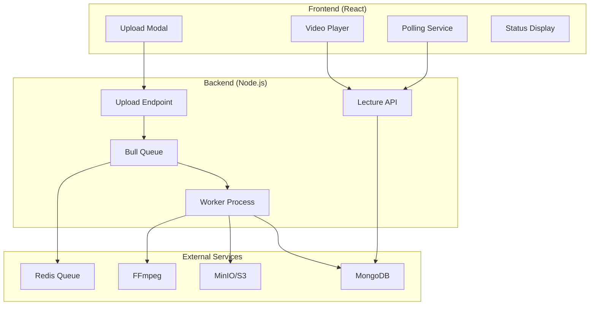
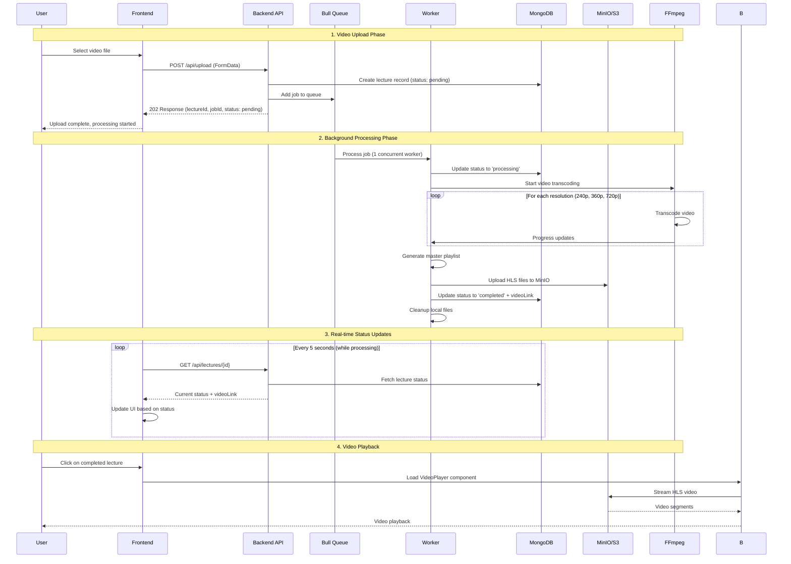
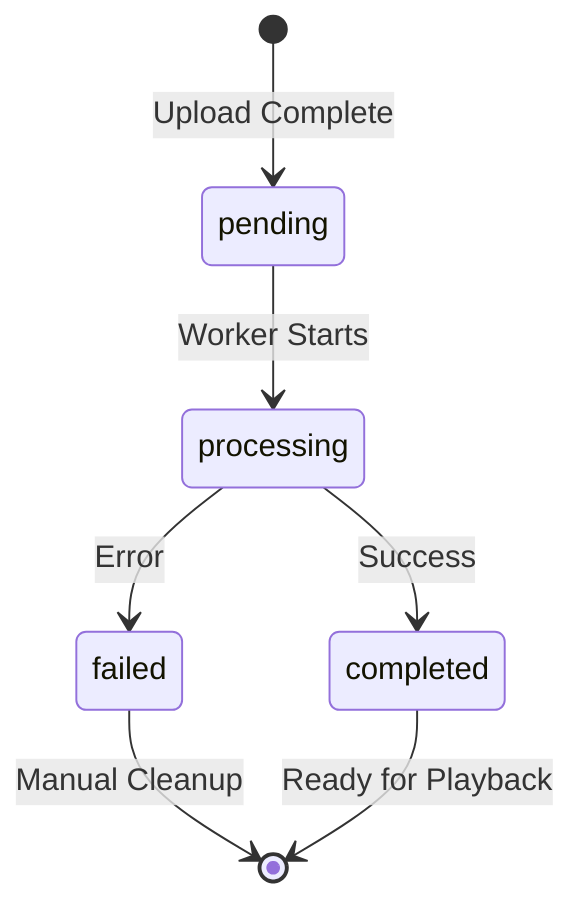

# Video Processing & Polling Mechanism - Complete Flow Analysis

## Table of Contents
1. [System Overview](#system-overview)
2. [Architecture Components](#architecture-components)
3. [Complete Flow Diagram](#complete-flow-diagram)
4. [Detailed Step-by-Step Process](#detailed-step-by-step-process)
5. [Polling Mechanism](#polling-mechanism)
6. [Status Management](#status-management)
7. [Error Handling](#error-handling)
8. [Code Analysis](#code-analysis)
9. [Performance Considerations](#performance-considerations)

---

## System Overview

This system implements **asynchronous video processing** with **real-time status polling** to provide a seamless user experience. Users can upload videos and continue using the application while videos are processed in the background.

### Key Features
- ✅ **Non-blocking uploads** - Users get immediate response
- ✅ **Background processing** - Videos processed using Bull Queue + Redis
- ✅ **Real-time status updates** - Frontend polls for processing status
- ✅ **Multi-resolution transcoding** - 240p, 360p, 720p HLS streams
- ✅ **Cloud storage** - Automatic upload to MinIO/S3
- ✅ **Error recovery** - Retry mechanisms and cleanup

---

## Architecture Components



---

## Complete Flow Diagram



---

## Detailed Step-by-Step Process

### Phase 1: Video Upload (Frontend → Backend)

#### 1.1 Frontend Upload (`AddTopicModal.jsx`)
```javascript
const handleSubmit = async (e) => {
    // Create FormData with video file
    const formData = new FormData();
    formData.append('uploadedFile', file);
    formData.append('courseId', courseId);
    formData.append('nameOfTopic', topicName);

    // Upload with progress tracking
    const response = await axios.post(uploadVideoUrl, formData, {
        onUploadProgress: (progressEvent) => {
            const percentCompleted = Math.round(
                (progressEvent.loaded * 100) / progressEvent.total
            );
            setUploadProgress(percentCompleted);
        },
    });

    // Close modal immediately after upload
    onTopicAdded();
    onClose();
};
```

#### 1.2 Backend Processing (`upload.js`)
```javascript
app.post('/', upload.single('uploadedFile'), async (req, res) => {
    // 1. Validate file and inputs
    const { courseId, nameOfTopic } = req.body;
    
    // 2. Generate unique job ID and video name
    const jobId = `${Date.now()}_${Math.random().toString(36).substring(2, 8)}`;
    const videoName = `${sanitizeFileName(path.parse(req.file.originalname).name)}_${jobId}`;
    
    // 3. Create lecture record BEFORE processing
    const lecture = new Lecture({
        courseId,
        nameOfTopic,
        processingStatus: 'pending',
        jobId: jobId,
        videoName: videoName
    });
    await lecture.save();
    
    // 4. Add job to Bull Queue
    const job = await videoProcessingQueue.add('process-video', {
        filePath: path.resolve(req.file.path),
        videoName,
        outputDir: path.join(__dirname, `../../public/hls/${videoName}`),
        resolutions: ['240p', '360p', '720p'],
        lectureId: lecture._id.toString()
    });
    
    // 5. Return immediately (202 Accepted)
    res.status(202).json({
        message: 'Video upload accepted and processing started',
        lectureId: lecture._id,
        jobId: jobId,
        processingStatus: 'pending'
    });
});
```

### Phase 2: Background Processing (Bull Queue Worker)

#### 2.1 Worker Process Setup
```javascript
// Single concurrent worker to prevent resource contention
videoProcessingQueue.process('process-video', 1, async (job) => {
    const { filePath, videoName, outputDir, resolutions, lectureId } = job.data;
    
    try {
        // Update status to processing
        await Lecture.findByIdAndUpdate(lectureId, {
            processingStatus: 'processing'
        });
        
        // Process video
        const result = await processVideo(filePath, videoName, outputDir, resolutions);
        
        // Upload to MinIO
        const minioResult = await uploadToMinIO(outputDir, `hls-videos/${videoName}`);
        
        // Update to completed
        await Lecture.findByIdAndUpdate(lectureId, {
            processingStatus: 'completed',
            videoLink: minioResult.masterPlaylistUrl
        });
        
        // Cleanup local files
        cleanupLocalFiles(outputDir);
        
    } catch (error) {
        // Update to failed status
        await Lecture.findByIdAndUpdate(lectureId, {
            processingStatus: 'failed',
            processingError: error.message
        });
        throw error;
    }
});
```

#### 2.2 FFmpeg Video Processing
```javascript
const processVideo = async (filePath, videoName, outputDir, resolutions) => {
    // Configuration for each resolution
    const resolutionConfigs = {
        '240p': { scale: '426:240', bitrate: '800k', maxrate: '856k', bufsize: '1200k' },
        '360p': { scale: '640:360', bitrate: '1400k', maxrate: '1498k', bufsize: '2100k' },
        '720p': { scale: '1280:720', bitrate: '2800k', maxrate: '2996k', bufsize: '4200k' }
    };

    // Process each resolution sequentially
    for (const res of resolutions) {
        const config = resolutionConfigs[res];
        const outputPath = path.join(outputDir, res);

        const ffmpegCommand = `ffmpeg -i "${filePath}" \
            -vf scale=${config.scale} \
            -c:v h264 -profile:v main -preset fast \
            -b:v ${config.bitrate} -maxrate ${config.maxrate} -bufsize ${config.bufsize} \
            -c:a aac -b:a 128k -ac 2 \
            -hls_time 6 \
            -hls_list_size 0 \
            -hls_segment_filename "${outputPath}/segment_%03d.ts" \
            -f hls \
            "${outputPath}/stream_${res}.m3u8"`;

        await executeFFmpegCommand(ffmpegCommand);
    }

    // Generate master playlist for adaptive streaming
    generateMasterPlaylist(outputDir, resolutions);
};
```

#### 2.3 MinIO Cloud Upload (`cloud.js`)
```javascript
const uploadToMinIO = async (localFolderPath, s3FolderPath) => {
    const allFiles = getAllFiles(localFolderPath);
    const BATCH_SIZE = 3; // Upload 3 files at a time
    
    // Process files in batches to avoid overwhelming server
    for (let i = 0; i < allFiles.length; i += BATCH_SIZE) {
        const batch = allFiles.slice(i, i + BATCH_SIZE);
        
        const batchPromises = batch.map(filePath => {
            const relativePath = path.relative(localFolderPath, filePath);
            const s3Key = `${s3FolderPath}/${relativePath}`.replace(/\\/g, '/');
            return uploadSingleFile(filePath, s3Key);
        });

        await Promise.all(batchPromises);
        
        // Add delay between batches
        if (i + BATCH_SIZE < allFiles.length) {
            await new Promise(resolve => setTimeout(resolve, 500));
        }
    }
    
    return {
        success: true,
        masterPlaylistUrl: `${process.env.MINIO_BROWSER_REDIRECT_URL}/${BUCKET_NAME}/${s3FolderPath}/master.m3u8`,
        uploadedFiles: allFiles.length,
        s3Path: s3FolderPath
    };
};
```

### Phase 3: Real-time Status Updates (Polling)

#### 3.1 Frontend Polling (`VideoClassroomUI.jsx`)
```javascript
// Auto-refresh for processing lectures - only poll specific lectures
useEffect(() => {
    const processingLectures = lectures.filter(
        lecture => lecture.processingStatus === 'pending' || 
                  lecture.processingStatus === 'processing'
    );

    if (processingLectures.length === 0) return;

    const interval = setInterval(async () => {
        console.log(`Polling ${processingLectures.length} processing lecture(s)...`);
        
        // Only refresh the specific lectures that are processing
        for (const lecture of processingLectures) {
            await refreshLecture(lecture._id);
        }
    }, 5000); // Poll every 5 seconds

    return () => clearInterval(interval);
}, [lectures, id]);

const refreshLecture = async (lectureId) => {
    try {
        const token = Cookies.get('token');
        const response = await fetch(`${process.env.REACT_APP_API_URL}/api/lectures/${lectureId}`, {
            headers: {
                'Authorization': `Bearer ${token}`,
                'Content-Type': 'application/json'
            }
        });
        
        const updatedLecture = await response.json();
        setLectures(prevLectures => prevLectures.map(lecture =>
            lecture._id === lectureId ? updatedLecture : lecture
        ));
    } catch (error) {
        console.error("Error refreshing lecture:", error);
    }
};
```

#### 3.2 Backend Status API (`lectureroutes.js`)
```javascript
router.get("/:id", authenticateToken, authorizeRole(['student', 'teacher']), checkLectureAccess, async (req, res) => {
    try {
        const lecture = await Lecture.findById(req.params.id)
            .populate("comments.userId", "username");

        if (!lecture) {
            return res.status(404).json({ error: "Lecture not found" });
        }
        
        console.log(`[DB] Found lecture: ${lecture.nameOfTopic} (status: ${lecture.processingStatus})`);
        res.json(lecture);
    } catch (error) {
        res.status(500).json({ error: error.message });
    }
});
```

### Phase 4: Video Playback

#### 4.1 Video Player Component (`VideoPlayer.jsx`)
```javascript
const VideoPlayer = ({ videoLink, lectureId, processingStatus }) => {
    // Show processing message if video is not ready
    if (!videoLink || (processingStatus && processingStatus !== 'completed')) {
        const statusMessages = {
            pending: { text: 'Video is being uploaded...', icon: '⏳' },
            processing: { text: 'Video is being processed...', icon: '⚙️' },
            failed: { text: 'Video processing failed', icon: '❌' }
        };

        const message = statusMessages[processingStatus] || statusMessages.pending;

        return (
            <div className="bg-black flex justify-center items-center">
                <div className="video-container relative w-full max-w-4xl aspect-video">
                    <div className="absolute inset-0 bg-gradient-to-br from-gray-900 to-black flex flex-col items-center justify-center text-white p-4">
                        <div className="text-6xl mb-4">{message.icon}</div>
                        <span className="text-xl font-semibold mb-2">{message.text}</span>
                        {processingStatus === 'processing' && (
                            <div className="mt-4">
                                <div className="animate-spin rounded-full h-12 w-12 border-b-2 border-white"></div>
                            </div>
                        )}
                    </div>
                </div>
            </div>
        );
    }

    // Initialize HLS player for completed videos
    useEffect(() => {
        const initializePlayer = async () => {
            if (Hls.isSupported()) {
                const hls = new Hls({
                    startLevel: -1,
                    maxMaxBufferLength: 30,
                    maxLoadingDelay: 4,
                    enableWorker: true
                });

                hls.loadSource(videoLink);
                hls.attachMedia(videoRef.current);
            }
        };

        initializePlayer();
    }, [videoLink]);
};
```

---

## Polling Mechanism

### Smart Polling Strategy

The system implements **intelligent polling** that only polls lectures currently being processed:

```javascript
// ✅ EFFICIENT: Only poll processing lectures
const processingLectures = lectures.filter(
    lecture => lecture.processingStatus === 'pending' || 
              lecture.processingStatus === 'processing'
);

if (processingLectures.length === 0) return; // Stop polling when done

// ❌ INEFFICIENT: Would poll all lectures
// setInterval(() => fetchAllLectures(), 5000);
```

### Polling Lifecycle

1. **Start Polling**: When lecture status is `pending` or `processing`
2. **Poll Frequency**: Every 5 seconds
3. **Stop Polling**: When status becomes `completed` or `failed`
4. **Cleanup**: Automatically clear intervals on component unmount

### Performance Benefits

- **Reduced Server Load**: Only active processing lectures are polled
- **Better UX**: Real-time updates without page refresh
- **Resource Efficient**: Polling stops when processing completes

---

## Status Management

### Lecture Status States

```javascript
// Lecture Model Schema
processingStatus: {
    type: String,
    enum: ['pending', 'processing', 'completed', 'failed'],
    default: 'pending'
}
```

### Status Flow



### Status-Based UI Rendering

```javascript
// Different UI based on processing status
const getStatusDisplay = (status) => {
    switch (status) {
        case 'pending':
            return { icon: '⏳', text: 'Video is being uploaded...', color: 'yellow' };
        case 'processing':
            return { icon: '⚙️', text: 'Video is being processed...', color: 'blue' };
        case 'completed':
            return { icon: '✅', text: 'Ready to play', color: 'green' };
        case 'failed':
            return { icon: '❌', text: 'Processing failed', color: 'red' };
    }
};
```

---

## Error Handling

### Multi-Level Error Recovery

#### 1. Upload Level Errors
```javascript
// File validation
const fileFilter = (req, file, callback) => {
    const validTypes = /\.(mp4|mov|m4v)$/i;
    const isValid = validTypes.test(file.originalname);
    
    if (isValid) {
        callback(null, true);
    } else {
        callback(new Error('Invalid file type. Only MP4, MOV, M4V allowed'));
    }
};
```

#### 2. Processing Level Errors
```javascript
// Worker error handling with cleanup
videoProcessingQueue.process('process-video', 1, async (job) => {
    try {
        // Processing logic...
    } catch (error) {
        // Cleanup on failure
        if (fs.existsSync(filePath)) {
            fs.unlinkSync(filePath);
        }
        cleanupLocalFiles(outputDir);
        
        // Update database
        await Lecture.findByIdAndUpdate(lectureId, {
            processingStatus: 'failed',
            processingError: error.message
        });
        
        throw error;
    }
});
```

#### 3. Playback Level Errors
```javascript
// HLS player error recovery
hls.on(Hls.Events.ERROR, (event, data) => {
    if (data.fatal) {
        switch (data.type) {
            case Hls.ErrorTypes.NETWORK_ERROR:
                hls.startLoad(); // Retry loading
                break;
            case Hls.ErrorTypes.MEDIA_ERROR:
                hls.recoverMediaError(); // Recover from media error
                break;
            default:
                initializePlayer(); // Reinitialize player
                break;
        }
    }
});
```

---

## Code Analysis

### Key Files and Their Roles

| File | Purpose | Key Functions |
|------|---------|---------------|
| `Backend/routes/videoprocessingroutes/upload.js` | Video upload & queue management | File upload, job creation, worker processing |
| `Backend/routes/videoprocessingroutes/cloud.js` | MinIO/S3 integration | Batch upload, file management, cleanup |
| `Backend/routes/lectureroutes.js` | Lecture CRUD operations | Status updates, lecture retrieval |
| `Backend/models/lecturemodel.js` | Database schema | Status tracking, metadata storage |
| `classroom/src/components/VideoClassroomUI.jsx` | Main UI component | Polling logic, status display |
| `classroom/src/components/VideoPlayer.jsx` | Video playback | HLS streaming, error handling |
| `classroom/src/components/TopicModal/AddTopicModal.jsx` | Upload interface | File selection, progress tracking |

### Database Schema Analysis

```javascript
// Lecture Model - Key Fields for Processing
{
    courseId: ObjectId,           // Course association
    nameOfTopic: String,          // Display name
    videoLink: String,            // Final HLS URL (set when completed)
    videoName: String,            // Sanitized folder name for cleanup
    processingStatus: String,     // Current processing state
    jobId: String,                // Bull queue job identifier
    processingError: String,      // Error message if failed
    // ... other fields
}
```

### Queue Configuration

```javascript
// Environment-specific queue naming
const environment = process.env.ENVIRONMENT || 'production';
const queueName = `video-processing-${environment}`;
const videoProcessingQueue = new Queue(queueName, process.env.REDIS_URL);

// Single concurrent worker to prevent resource conflicts
videoProcessingQueue.process('process-video', 1, processVideoJob);
```

---

## Performance Considerations

### 1. Concurrency Management

**Current Setup**: 1 concurrent worker
```javascript
// Prevents resource contention and alternating failures
videoProcessingQueue.process('process-video', 1, processVideoJob);
```

**Scaling Options**:
- **Horizontal**: Multiple servers with 1 worker each
- **Vertical**: Powerful server with 2-3 workers
- **Hybrid**: Load balancer + multiple worker servers

### 2. Memory Management

**File Cleanup Strategy**:
```javascript
// Immediate cleanup after processing
cleanupLocalFiles(outputDir);           // Remove HLS files
fs.unlinkSync(filePath);               // Remove original upload
```

**Batch Upload to MinIO**:
```javascript
const BATCH_SIZE = 3;                  // Upload 3 files at a time
const DELAY_BETWEEN_BATCHES = 500;     // 500ms delay between batches
```

### 3. Network Optimization

**HLS Streaming Benefits**:
- Adaptive bitrate streaming
- Progressive download
- CDN-friendly segmented files
- Mobile-optimized delivery

### 4. Database Optimization

**Efficient Polling Queries**:
```javascript
// Only fetch specific lecture, not all lectures
const lecture = await Lecture.findById(lectureId);

// Index on processingStatus for efficient filtering
// db.lectures.createIndex({ "processingStatus": 1 })
```

---

## Summary

This video processing system provides a robust, scalable solution for handling video uploads with the following key benefits:

### ✅ **User Experience**
- Immediate upload response (202 Accepted)
- Real-time status updates via polling
- Non-blocking interface during processing
- Adaptive video streaming with quality selection

### ✅ **System Architecture**
- Asynchronous processing with Bull Queue
- Single worker prevents resource conflicts
- Automatic cleanup and error recovery
- Cloud storage with MinIO/S3 integration

### ✅ **Performance & Scalability**
- Intelligent polling (only active lectures)
- Batch file uploads to cloud storage
- Multi-resolution HLS streaming
- Environment-specific queue isolation

### ✅ **Error Handling**
- Multi-level error recovery
- Automatic cleanup on failures
- Detailed error logging and status tracking
- Retry mechanisms for network issues

The system successfully separates upload, processing, and playback concerns while maintaining real-time communication between frontend and backend through efficient polling mechanisms.